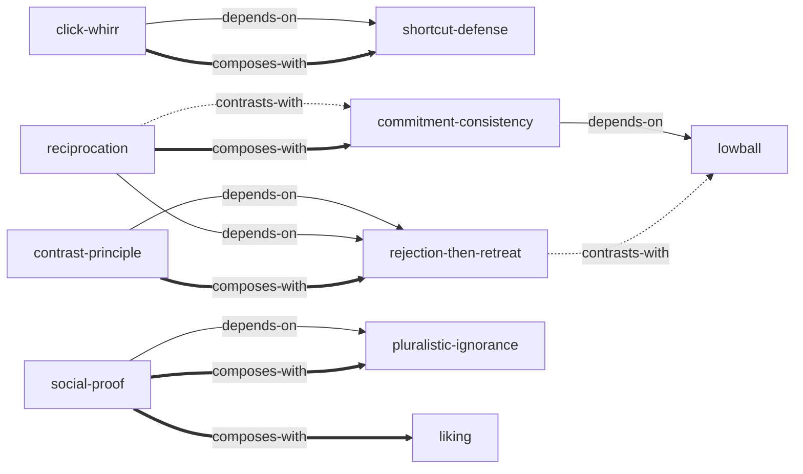

# 影响力 — Skill Index

> 本书由 [cangjie-skill](https://github.com/kangarooking/cangjie-skill) 蒸馏, 共产出 **12** 个 skills。
> 处理时间: 2026-05-03

## 关于这本书

- **作者**: 罗伯特·B·西奥迪尼 (Robert B. Cialdini)
- **出版年**: 1984年初版 / 1993年修订 / 2015年中文珍藏版
- **一句话主旨**: 六条心理原则（互惠、承诺一致、社会认同、喜好、权威、稀缺）能触发自动化的顺从反应，被系统性地利用来影响行为
- **整书理解**: 见 [BOOK_OVERVIEW.md](./BOOK_OVERVIEW.md)

---

## Skill 列表 (按主题分组)

### 基础机制

- [`click-whirr`](./click-whirr/SKILL.md) — 自动反应模式识别：识别"按一下就播放"的触发特征与固定行为模式
- [`contrast-principle`](./contrast-principle/SKILL.md) — 对比原理识别与应用：理解先后顺序如何扭曲感知判断
- [`shortcut-defense`](./shortcut-defense/SKILL.md) — 捷径反应系统性防御：区分真实触发与伪造触发的元框架

### 互惠与让步

- [`reciprocation`](./reciprocation/SKILL.md) — 互惠原理识别与防御：识别不请自来的恩惠如何创造义务感
- [`rejection-then-retreat`](./rejection-then-retreat/SKILL.md) — 拒绝-后撤策略：识别大要求→小要求的让步操控手法

### 承诺与一致

- [`commitment-consistency`](./commitment-consistency/SKILL.md) — 承诺和一致原理：识别小承诺如何改变自我认知并驱动大行为
- [`lowball`](./lowball/SKILL.md) — 抛低球/承诺自生长：识别"先给甜头再撤回"的操控手法

### 社会影响

- [`social-proof`](./social-proof/SKILL.md) — 社会认同原理：识别"别人都在做"如何触发自动顺从
- [`pluralistic-ignorance`](./pluralistic-ignorance/SKILL.md) — 多元无知破解：识破"人人观望→人人不动"的群体困境

### 人际吸引力

- [`liking`](./liking/SKILL.md) — 喜好原理识别与防御：识别好感因素（外表、相似、恭维、合作、关联）如何被系统利用

### 权威与服从

- [`authority`](./authority/SKILL.md) — 权威原理识别与防御：区分真正专家与权威象征（头衔、衣着、身份标志）

### 稀缺与损失

- [`scarcity`](./scarcity/SKILL.md) — 稀缺原理识别与防御：识别"数量有限""限时""竞争"如何触发非理性渴望

---

## 引用图



图例:
- `-->`  depends-on
- `-.->` contrasts-with
- `===>` composes-with

---

## 推荐学习顺序

(从依赖图的叶子节点开始, 向上)

1. **click-whirr** — 最基础，理解"按一下就播放"的底层机制
2. **contrast-principle** — 独立的基础感知原理
3. **reciprocation** — 六大原则的第一条，独立可学
4. **commitment-consistency** — 六大原则的第二条，独立可学
5. **social-proof** — 六大原则的第三条，独立可学
6. **liking** — 六大原则的第四条，独立可学
7. **authority** — 六大原则的第五条，独立可学
8. **scarcity** — 六大原则的第六条，独立可学
9. **rejection-then-retreat** — 依赖 reciprocation + contrast-principle
10. **lowball** — 依赖 commitment-consistency
11. **pluralistic-ignorance** — 依赖 social-proof
12. **shortcut-defense** — 综合所有原则的元防御框架

---

## Generated by Cangjie Skill

本仓库由 [cangjie-skill](https://github.com/kangarooking/cangjie-skill) 生成——一个把书蒸馏成可执行 AI skills 的开源工具链。

cangjie-skill 基于 RIA-TV++ 方法论，将书籍中的方法论、框架、原则提取为原子化的 skill，可被 AI agent 在真实场景中直接调用。

---

## 接入 darwin-skill

所有 skill 均带有 `test-prompts.json` (darwin-skill 兼容格式), 可直接接入自动进化:

```
darwin evolve books/influence-skill/
```

---

## 审计轨迹

- 候选单元池: [candidates/](./candidates/)
- 三重验证通过: [verified.md](./verified.md)
- BOOK_OVERVIEW: [BOOK_OVERVIEW.md](./BOOK_OVERVIEW.md)
